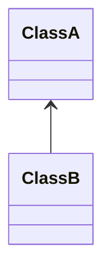
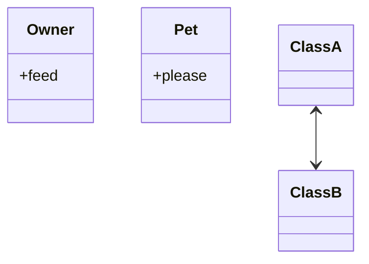
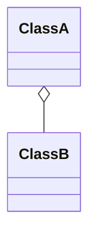
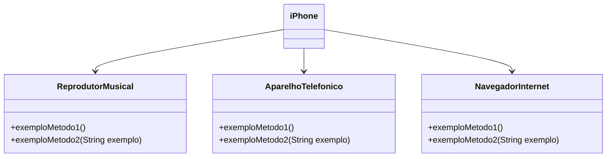

# OOP - UML (Made with [Mermaid](https://mermaid.js.org/))

## Association

Relationship between two objects

### Simple Association

### Bidirectional Association

owners feed pets, pets please owners

## Aggregation

Aggregation implies a relationship where the child can exist independently of the parent.

# Other Example

