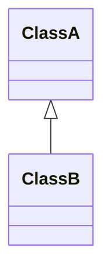
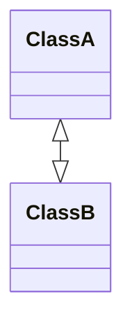
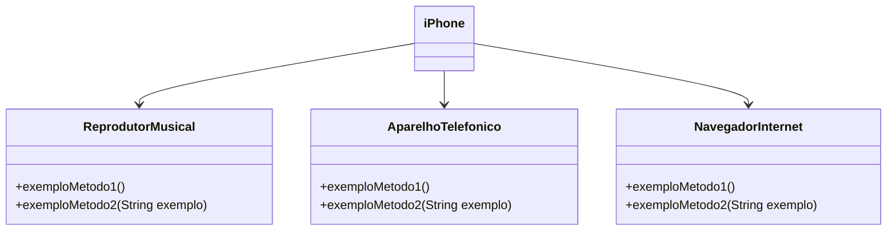

# OOP - UML (Made with [Mermaid]())

## Association

Relationship between two objects

### Simple Association

```mermaid
classDiagram
    class ClassA {

    }

    class ClassB {

    }

    ClassA <|-- ClassB
```

### Bidirectional Association

```mermaid
classDiagram
    class ClassA {

    }

    class ClassB {

    }

    ClassA <|--|> ClassB
```

# Other Example

```mermaid
classDiagram
    class ReprodutorMusical {
        +exemploMetodo1()
        +exemploMetodo2(String exemplo)
    }

    class AparelhoTelefonico {
        +exemploMetodo1()
        +exemploMetodo2(String exemplo)
    }

    class NavegadorInternet {
        +exemploMetodo1()
        +exemploMetodo2(String exemplo)
    }

    class iPhone {
    }

    iPhone --> ReprodutorMusical
    iPhone --> AparelhoTelefonico
    iPhone --> NavegadorInternet
```
