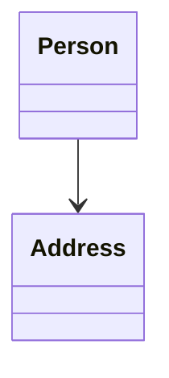
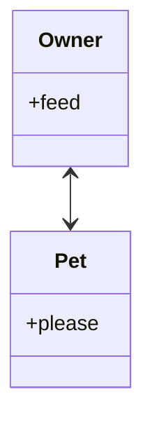
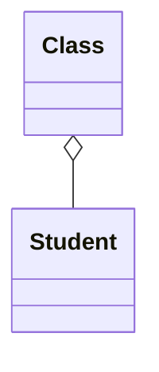
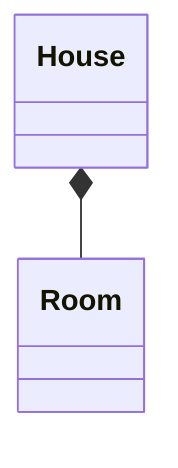
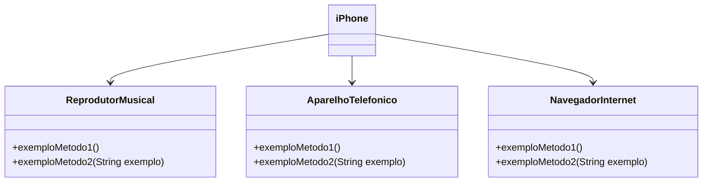

# OOP - UML (Made with [Mermaid](https://mermaid.js.org/))

## Association

Relationship between two objects

### Simple Association

A person has an address



### Bidirectional Association

Owners feed pets, pets please owners


## Aggregation

Implies a relationship where the child can exist independently of the parent. Example: Class (parent) and Student (child). Delete the Class and the Students still exist.



## Composition

Implies a relationship where the child cannot exist independent of the parent. Example: House (parent) and Room (child). Rooms don't exist separate to a House.



## Cardinality / Multiplicity on relations

 - 1 Only 1
 - 0..1 Zero or One
 - 1..* One or more
 - * Many
 - n n (where n>1)
 - 0..n zero to n (where n>1)
 - 1..n one to n (where n>1)

```
classDiagram
    Customer "1" --> "*" Ticket
    Student "1" --> "1..*" Course
    Galaxy --> "many" Star : Contains
```

# Other Example


